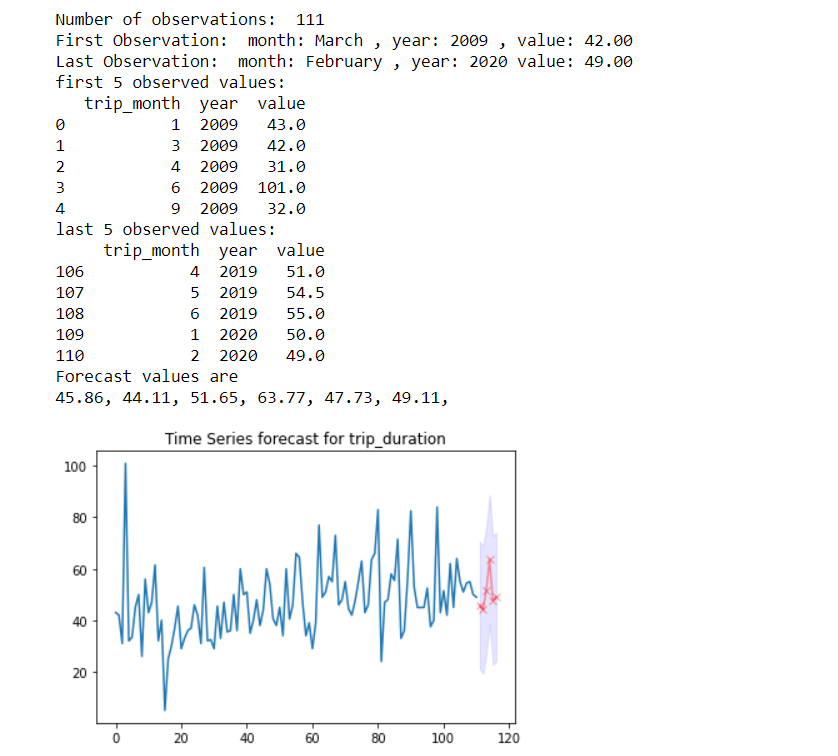

# New York Taxi Time Series Forecast Project
## About NY Taxi
The New York City Taxi and Limousine Commission (TLC) was created in 1971. This agency is responsible for licensing and regulating New York City's Medallion (Yellow) taxi cabs, for-hire vehicles (community-based liveries, black cars and luxury limousines), commuter vans, and paratransit vehicles opereate in the city. It is approximated that about one million trips are recorded each day. There are Four types of trips broken down into Yellow Taxi, Green Taxi, For-Hire Vehicle (FHV) and High Volume For-Hire Vehicle (FHVHV). TLC receives taxi trip data from the technology service providers (TSPs) that provide electronic metering in each cab, and FHV trip data from the app, community livery, black car, or luxury limousine company, or base, who dispatched the trip. Visit [About TLC](https://www1.nyc.gov/site/tlc/about/about-tlc.page) for more info. 

## Project Objective
This project is a follow-up project from [NY Big Data Analytic Project](https://github.com/MSBGDA/INFO-H-600-Project-Group-AH.git) which we used the the final output dataset to build an interactive time seriesforecast for trip distance and trip amount for taxis. 
## Repository Content
The [forecast notebook](https://github.com/ivombi/NY-Taxi-Forecast/blob/main/forecast.ipynb) contains the code to replicate the project
## Highlight of Resutls

## Implement Locally
To implement this project locally on your personal laptop, you need to [clone ](https://github.com/ivombi/NY-Taxi-Forecast.git) this repository and run the [forecast](https://github.com/ivombi/NY-Taxi-Forecast/blob/main/forecast.ipynb) notebook. Sample result  Below
 

## Related Project
> - [New York Big Data Analytic Project](https://github.com/MSBGDA/INFO-H-600-Project-Group-AH.git)
> - [New York Taxi Visualization Project](https://github.com/ivombi/NY-Taxi.git)
